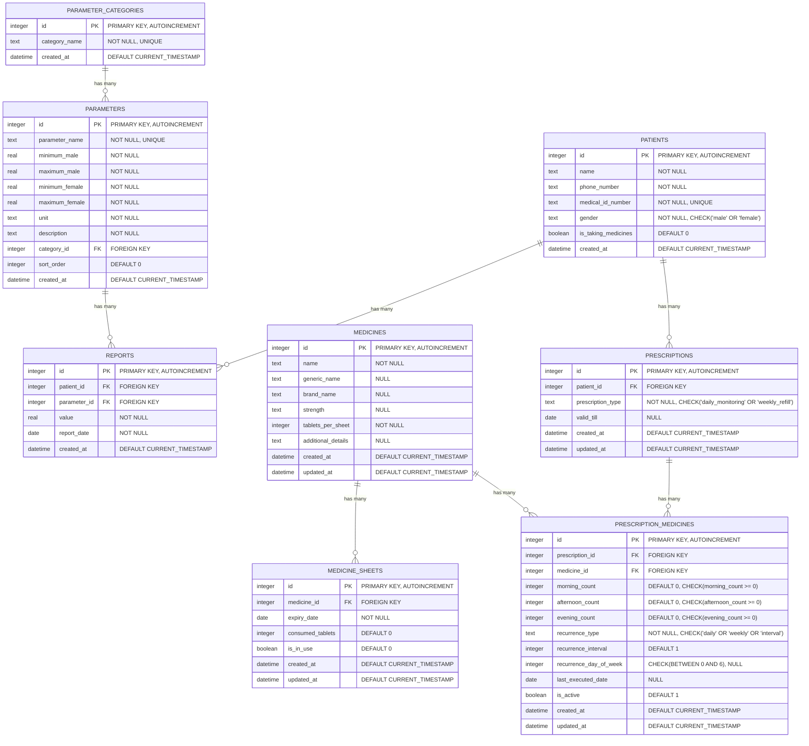

# Medical Manager Database Schema

## Entity Relationship Diagram (Mermaid)

## Database Schema Overview

### Core Entities

1. **PARAMETER_CATEGORIES**
   - Purpose: Organize medical parameters into logical categories
   - Key: Unique category names for organization

2. **PARAMETERS**
   - Purpose: Define medical parameters with gender-specific normal ranges
   - Key Features: Min/max values for both genders, units, descriptions
   - Relationship: Belongs to a parameter category

3. **PATIENTS**
   - Purpose: Store patient information
   - Key Features: 
     - Unique medical ID for patient identification
     - Gender-specific data for medical parameters
     - Medicine status tracking with `is_taking_medicines` field
   - Constraints: Gender must be 'male' or 'female'
   - Medicine Status: Default FALSE (not taking medicines), TRUE (taking medicines)

4. **REPORTS**
   - Purpose: Store medical test results
   - Key Features: Links patients to parameters with measured values
   - Relationships: References both patients and parameters

### Medicine Inventory System

5. **MEDICINES**
   - Purpose: Master list of available medicines
   - Key Features: Generic/brand names, strength, tablets per sheet
   - Constraints: Unique combination of name and strength

6. **MEDICINE_SHEETS**
   - Purpose: Track individual medicine sheets for inventory management
   - Key Features: Expiry dates, consumption tracking, usage status
   - Relationship: Each sheet belongs to a medicine

### Prescription System

7. **PRESCRIPTIONS**
   - Purpose: Define prescription plans for patients
   - Key Features: 
     - `prescription_type`: 'daily_monitoring' (track daily consumption) or 'weekly_refill' (weekly medicine refill)
     - `valid_till`: Optional expiry date for time-limited prescriptions
     - Active/inactive status for prescription management
   - Relationship: Each prescription belongs to a patient

8. **PRESCRIPTION_MEDICINES**
   - Purpose: Define individual medicine entries within prescriptions
   - Key Features:
     - `morning_count`, `afternoon_count`, `evening_count`: Number of tablets per timing (0 or more)
     - `recurrence_type`: Pattern type ('daily', 'weekly', 'interval')
     - `recurrence_interval`: Frequency (e.g., every 2 days, every 3 weeks)
     - `recurrence_day_of_week`: Specific day for weekly recurrence (0=Sunday, 6=Saturday)
     - `last_executed_date`: Tracks when this specific medicine instruction was last completed
   - Individual Medicine Tracking:
     - Each prescription-medicine combination tracks its own execution independently
     - Enables granular control over medicine instructions
     - Users can mark individual medicines as completed rather than entire prescriptions
   - Medicine Instructions Logic:
     - Daily monitoring: Show if 1+ days since last execution for this specific medicine
     - Weekly refill: Show if 7+ days since last execution for this specific medicine
     - Never executed medicines always show instructions
     - Recurrence patterns determine when medicine is due again
   - Calculation Support: Structured recurrence data enables automatic scheduling
   - Examples:
     - Daily: `recurrence_type='daily', recurrence_interval=1`
     - Every 2 days: `recurrence_type='interval', recurrence_interval=2`
     - Weekly on Wednesday: `recurrence_type='weekly', recurrence_day_of_week=3`
   - Relationships: Links prescriptions to medicines

### Individual Medicine Instruction Tracking

The system supports granular tracking of medicine instructions at the individual medicine level:

- **Individual Execution Tracking**: Each `prescription_medicine` record has its own `last_executed_date`
- **Independent Scheduling**: Same medicine in different prescriptions can have different execution schedules
- **Granular User Control**: Users can mark individual medicine instructions as completed
- **Flexible Recurrence**: Each medicine can have its own recurrence pattern within a prescription
- **Optimized Queries**: Single JOIN query retrieves all patient instructions with execution status

**Example Scenarios:**
- Patient has Aspirin in both daily monitoring (1 tablet/morning) and weekly refill (7 tablets/week)
- User can mark daily Aspirin as taken without affecting weekly refill schedule
- Each medicine instruction appears separately in the UI with its own "Done" button

### Key Relationships

- **One-to-Many Relationships:**
  - Parameter Categories → Parameters
  - Patients → Reports
  - Parameters → Reports  
  - Medicines → Medicine Sheets
  - Patients → Prescriptions
  - Prescriptions → Prescription Medicines
  - Medicines → Prescription Medicines

- **Many-to-Many Relationships:**
  - Medicines ↔ Prescriptions (through Prescription Medicines)

### Database Features

- **Foreign Key Constraints:** Enabled for data integrity
- **Cascade Deletes:** Removing a parent record removes related child records
- **Unique Constraints:** Prevent duplicate data where appropriate
- **Check Constraints:** Ensure valid gender values
- **Default Values:** Automatic timestamps and sensible defaults
- **WAL Mode:** Write-Ahead Logging for better performance

### Data Types Used

- `INTEGER`: Primary keys, counts, references
- `TEXT`: Names, descriptions, identifiers
- `REAL`: Numeric measurements, parameter ranges
- `DATE`: Specific dates (expiry, report dates)
- `DATETIME`: Timestamps with time components
- `BOOLEAN`: True/false flags (is_in_use)
